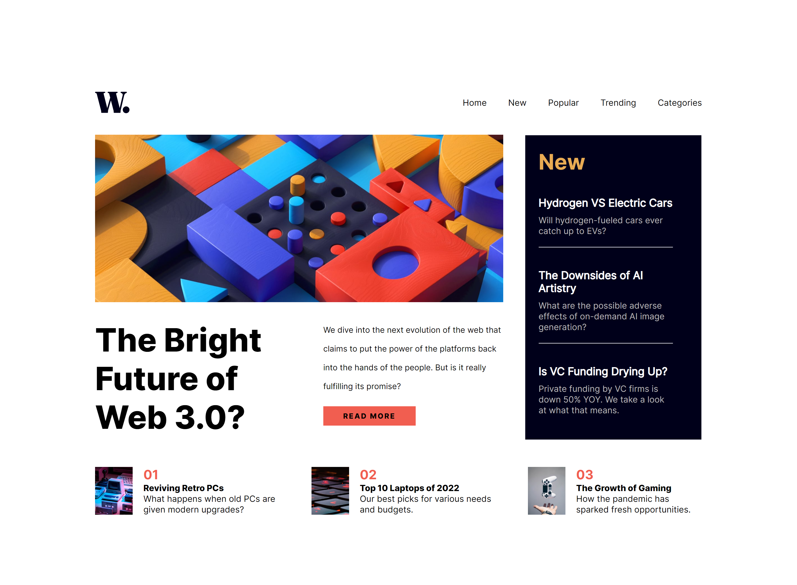

# Frontend Mentor - News homepage solution

This is a solution to the [News homepage challenge on Frontend Mentor](https://www.frontendmentor.io/challenges/news-homepage-H6SWTa1MFl). Frontend Mentor challenges help you improve your coding skills by building realistic projects. 

## Table of contents

- [Overview](#overview)
  - [The challenge](#the-challenge)
  - [Screenshot](#screenshot)
  - [Links](#links)
- [Author](#author)

**Note: Delete this note and update the table of contents based on what sections you keep.**

## Overview

### The challenge

Users should be able to:

- View the optimal layout for the interface depending on their device's screen size
- See hover and focus states for all interactive elements on the page

### Screenshot

### Links
- Live Site URL: [Zion](https://news-landing-page-kohl.vercel.app/)

## Author

- Website - [Zion](https://github.com/heisayon/)
- Frontend Mentor - [@heisayon](https://www.frontendmentor.io/profile/heisayon)
- Twitter - [@heisayon](https://www.twitter.com/heisayon)

